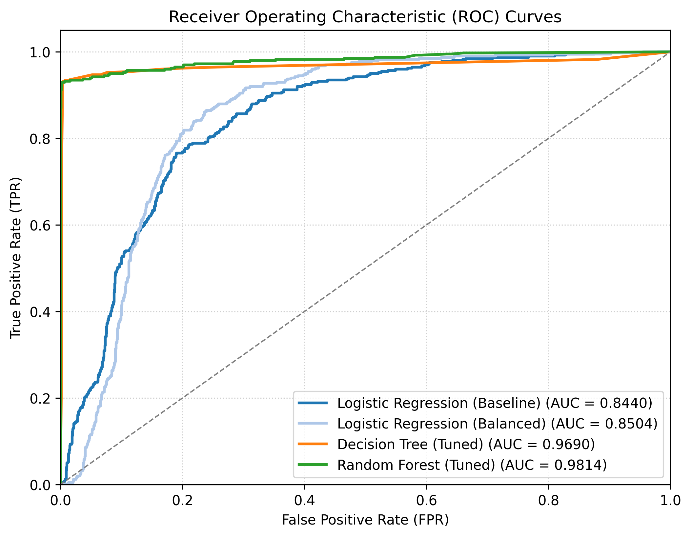

# Salifort Retention Project: Predicting Employee Churn

This project builds an end-to-end data science solution to predict employee attrition at Salifort Motors and identify its key driving factors. Using a dataset of employee work metrics, we compare three predictive models (Logistic Regression, Decision Tree, and Random Forest) to select the optimal classifier for deployment.

---

## 🎯 Business Goal

Employee turnover (attrition) is extremely costly, leading to recruitment costs, lost productivity, and diminished team morale. The goals of this project are:
1. **Predictive Modeling**: Build a classification model to identify employees at high risk of leaving (highest priority).
2. **Interpretability**: Identify the main drivers of employee churn to provide actionable recommendations for Human Resources (HR) to improve retention.

---

## 📂 Project Structure

```text
├── README.md                       # Project documentation and summary
├── requirements.txt                # Python dependency specifications
├── data/                           # Data files (ignored by git, except folder structure)
│   ├── raw/                        # Original capstone dataset
│   └── processed/                  # Cleaned and encoded dataset
├── src/                            # Production-grade modular source code
│   ├── preprocessing.py            # Data cleaning, outlier info, and feature engineering
│   ├── modeling.py                 # Model training, grid searches, evaluation, and ROC plots
│   ├── train_pipeline.py           # End-to-end training, evaluation, and ROC curve generation
│   └── validate_model.py           # Model integrity assertions using dummy employee profiles
├── notebooks/                      # Exploration and reporting notebooks
│   ├── 01_eda_and_modeling.ipynb   # Full EDA, modeling walkthrough, and results analysis
│   ├── 02_executive_report.ipynb   # Stakeholder-facing report (no training code)
│   └── models/                     # Pickled models synced locally (git-ignored)
├── tests/                          # Automated unit tests
│   ├── test_preprocessing.py       # Tests for clean_data and engineer_features
│   └── test_modeling.py            # Tests for evaluate_model, prepare_splits, save/load
├── reports/
│   └── figures/
│       └── roc_comparison.png      # Comparative ROC curves for all 4 models
└── app/
    └── main.py                     # Interactive Streamlit dashboard for HR teams
```

---

## 🧼 Data Preprocessing & Cleaning

1. **Deduplication**: Successfully identified and removed **3,008 duplicate rows**, reducing the dataset from 14,999 to **11,991 clean records**. This prevents model overfitting and data leakage.
2. **Column Standardization**: Cleaned spelling errors and standardized column names to `snake_case` (e.g., `average_montly_hours` → `average_monthly_hours`, `time_spend_company` → `tenure`).
3. **Outlier Strategy**: Evaluated outliers in `tenure` using the IQR method. Although 824 outliers were detected (tenure > 5.5 years), **they were kept in the dataset**. In employee attrition modeling, senior employees with longer tenures represent a crucial workforce segment. Removing them would bias the model and prevent it from learning the distinct churn patterns of long-tenured employees.
4. **Encoding**:
   - Mapped `salary` ordinally (`low`: 0, `medium`: 1, `high`: 2).
   - One-hot encoded `department` dummies with `drop_first=True`.

---

## 📈 Key Insights from EDA

* **The Overworked Threshold**: Employees working more than **240 hours per month** (approx. 55-60 hours/week) show an extremely high rate of attrition, especially when assigned to **6 or more projects**.
* **The Attrition Profile**: Employees who leave typically fall into two main clusters:
  1. *The Overworked & Dissatisfied*: High evaluations (≥ 0.8), high monthly hours (≥ 240), low satisfaction (≤ 0.11). These are high performers experiencing burnout.
  2. *The Underworked & Dissatisfied*: Moderate evaluations (≈ 0.5), low monthly hours (≈ 150), low satisfaction (≈ 0.4). These employees are likely disengaged.
* **Tenure Risk**: Retention risk peaks heavily at **3 to 5 years of tenure**; drop-off rates decrease significantly after year 6.

---

## 📊 Model Comparison & Results

All models were evaluated on an independent, stratified **20% test set** (N = 2,399).

| Model | Test Precision | Test Recall | Test F1-Score | Test Accuracy | Test AUC |
| :--- | :---: | :---: | :---: | :---: | :---: |
| **Logistic Regression (Baseline)** | 0.5000 | 0.1910 | 0.2764 | 0.8341 | 0.8440 |
| **Logistic Regression (Balanced)** | 0.4209 | **0.8417** | 0.5611 | 0.7816 | 0.8504 |
| **Decision Tree (Tuned)** | 0.9738 | 0.9322 | 0.9525 | 0.9846 | 0.9690 |
| **Random Forest (Tuned)** | **0.9893** | 0.9271 | **0.9572** | **0.9862** | **0.9814** |

### Comparative ROC Curves



> All 4 model variants plotted on a single chart — generated automatically at the end of `src/train_pipeline.py`.

### Key Takeaways
* **Random Forest** is the top-performing model, achieving a **95.72% F1-score** and **98.14% ROC-AUC**. It correctly identifies the majority of leaving employees with almost zero false positives (Precision: 98.93%).
* **Logistic Regression (Balanced)**: By applying `class_weight='balanced'`, recall was boosted from **19.10% to 84.17%**, making it a strong linear baseline that captures high-risk employees even at the cost of precision.

---

## 🧬 Feature Importances (Random Forest)

The Random Forest model identified the following features as the top drivers of employee attrition:

1. **Satisfaction Level** — by far the most dominant predictor (~50% weight)
2. **Last Evaluation** — extreme scores (very high or very low) predict churn
3. **Tenure** — years 3–6 are the critical retention window
4. **Number of Projects** — overload and underload are both risk signals
5. **Average Monthly Hours** — key burnout indicator

---

## 💼 Actionable HR Recommendations

Based on the model's insights, Salifort Motors should implement the following retention strategies:

1. **Workload Caps**: Establish a hard limit of **4 to 5 projects** per employee and cap monthly working hours at **200–220 hours**. High workload is directly linked to the churn of top-performing employees.
2. **Tenure Interventions**: Implement targeted retention reviews, career growth pathways, or retention bonuses for employees approaching their **3rd to 5th anniversaries**.
3. **Reward Alignment**: Review the compensation and promotion schedules of high-performing employees (evaluation ≥ 0.8). Many leaving employees have high evaluations but have not been promoted in the last 5 years.
4. **Satisfaction Pulse Surveys**: Since satisfaction is the strongest predictor of churn, implement quarterly pulse surveys to identify rapid drops in satisfaction and trigger preemptive 1-on-1 career discussions.

---

## 🛠️ How to Run the Project

### 1. Set Up the Environment

```bash
python3 -m venv venv
source venv/bin/activate
pip install -r requirements.txt
```

### 2. Run the Machine Learning Pipeline

Cleans raw data, trains and tunes all 4 model variants, prints the comparison table, generates the ROC comparison plot, and saves the best model:

```bash
PYTHONPATH=src python3 src/train_pipeline.py
```

> Output: `notebooks/models/hr_rf1.pickle`, `notebooks/models/scaler.pickle`, `reports/figures/roc_comparison.png`

### 3. Run Unit Tests

Validates data engineering rules and modeling API correctness (8 tests):

```bash
PYTHONPATH=src pytest tests/ -v
```

### 4. Launch the Interactive Dashboard

Starts the Streamlit web app for HR teams to evaluate employee churn risk in real time:

```bash
streamlit run app/main.py
```

> Opens at `http://localhost:8501`

### 5. Open the Notebooks

| Notebook | Audience | Description |
| :--- | :--- | :--- |
| `notebooks/01_eda_and_modeling.ipynb` | Technical | Full EDA, model training code, tuning details, and results |
| `notebooks/02_executive_report.ipynb` | Business / Stakeholders | Clean report with key charts, model comparison, and HR recommendations — no training code |

---

## 📦 Requirements

Key dependencies (see `requirements.txt` for pinned versions):

| Package | Purpose |
| :--- | :--- |
| `pandas`, `numpy` | Data manipulation |
| `scikit-learn` | Model training, GridSearchCV, metrics |
| `matplotlib`, `seaborn` | Visualizations |
| `nbformat`, `ipykernel` | Notebook execution |
| `pytest` | Automated unit testing |
| `streamlit` | Interactive HR dashboard |
